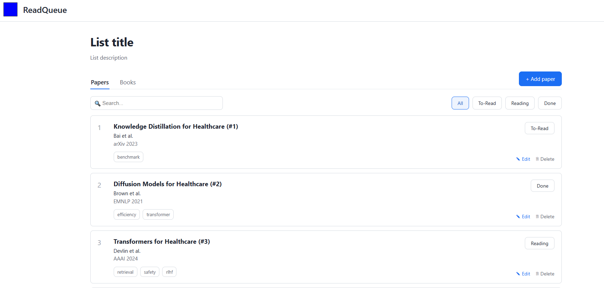

# ReadQueue

ReadQueue is a shared reading-list web app for research groups, study groups, or
book clubs. Members keep a common queue of **papers** and **books**, track each
item's reading progress (To-Read / Reading / Done), organize items with tags,
search and filter the list, and discuss each item through threaded comments.

The frontend is rendered entirely on the client with vanilla JavaScript, talking
to a REST API backed by Node, Express, and MongoDB.

## Author

CS5610 Group 14 — Jiachen Zhao, Nathalie Cabrera

## Class link

[CS5610 Web Development (Northeastern University)](https://johnguerra.co/classes/webDevelopment_online_summer_2026/)


## Features

- **Papers and books** in separate tabs, each with its own collection.
- **Full CRUD** — add, edit, and delete items through a form, or delete inline.
- **Status tracking** — cycle an item between To-Read, Reading, and Done.
- **Tags** for categorizing items.
- **Search** by title or author, and **filter** by status.
- **Comments** — each item has its own comment thread (commenter name + text).
- **Client-side rendering** — the list and comments are built in the browser
  from API responses.

## Design Mockups and Project Details: 
https://canva.link/h4mnfsgdi1midmu
[Design Documents](./design%20document.pdf)

## Demo:
https://youtu.be/QwUyOxT_Xsw


## Tech stack

- **Backend:** Node.js, Express 5 (ES modules)
- **Database:** MongoDB (official `mongodb` driver)
- **Frontend:** HTML, CSS (one stylesheet per module), vanilla JavaScript
- **Tooling:** ESLint, Prettier

## Project structure

```
server.js              Express app — serves /public and mounts the API
seed.js                Inserts sample data (npm run seed)
models/
  db.js                MongoDB connection (connectDB / getDB)
  Paper.js             Papers collection: CRUD + embedded comments
  Book.js              Books collection
routes/
  papers.js            /api/papers endpoints
  books.js             /api/books endpoints
public/
  index.html           Single-page UI
  css/                 base.css, cards.css, landing.css
  js/landing.js        Frontend logic: render, CRUD, search/filter, comments
```

## API

| Method | Path                       | Description                  |
| ------ | -------------------------- | ---------------------------- |
| GET    | `/api/papers`              | list papers                  |
| GET    | `/api/papers/:id`          | one paper (with comments)    |
| POST   | `/api/papers`              | create a paper               |
| PUT    | `/api/papers/:id`          | edit a paper / change status |
| DELETE | `/api/papers/:id`          | delete a paper               |
| POST   | `/api/papers/:id/comments` | add a comment to a paper     |

Books expose the same endpoints under `/api/books`.

## Screenshot




## Build and run

1. **Install dependencies**

   ```bash
   npm install
   ```

2. **Configure the database** — copy the example env file and set your MongoDB
   connection string. `.env` is gitignored and must never be committed.

   ```bash
   cp .env.example .env
   ```

   ```
   MONGODB_URI=mongodb+srv://<user>:<password>@<cluster>.mongodb.net/
   PORT=3000
   ```

3. **Seed sample data (optional)**

   ```bash
   npm run seed
   ```

4. **Start the server**

   ```bash
   npm run dev
   ```

   Then open <http://localhost:3000>.

## Scripts

- `npm run dev` — start the server with auto-reload
- `npm run seed` — insert sample papers
- `npm run lint` — run ESLint
- `npm run format` — format the codebase with Prettier

## License

[MIT](LICENSE)
